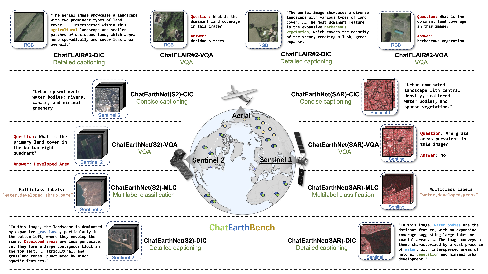

# ChatEarthBench: Benchmarking Multimodal Large Language Models for Earth Observation

**ChatEarthBench** is a benchmark for evaluating multimodal large language models (MLLMs) on Earth observation (EO) tasks under a **zero-shot setting**.

---


## Website

🔗 https://zhu-xlab.github.io/chatearthbench/

---




## Citation

```bibtex
@article{Yuan2026ChatEarthBench,
  title   = {ChatEarthBench: Benchmarking Multimodal Large Language Models for Earth Observation},
  author  = {Zhenghang Yuan and Zhitong Xiong and Thomas Dujardin and Xiang Li and Lichao Mou and Xiao Xiang Zhu},
  journal = {IEEE Geoscience and Remote Sensing Magazine},
  year    = {2026}
}
